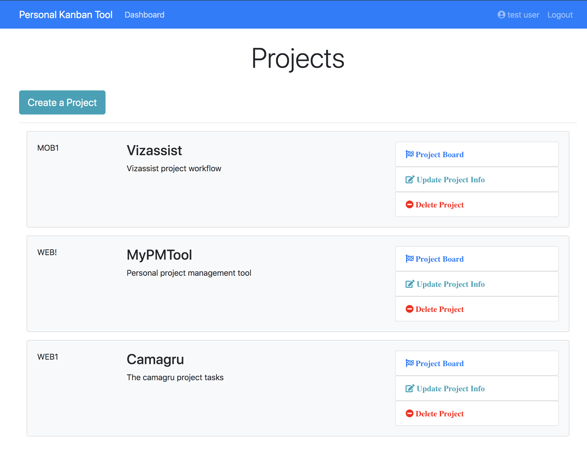
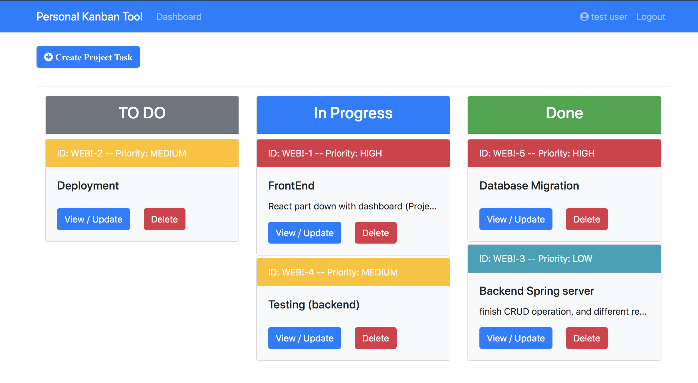

# MyPMTool

## Tech stack
**Frontend:** React, Redux 
**Backend:** Java Spring Boot 
**Database:** MySQL (H2, JPA) 

## Application Figures
Project page:

 
Task Page:

## How it works?
* First, create a project and it will display along with other project
* Second, select the project you are working on, it will direct you to the tasks page
* Third, start create tasks for new features, and update tasks with the process
* Note: You need to create a user account, every account has its own projects and tasks data
